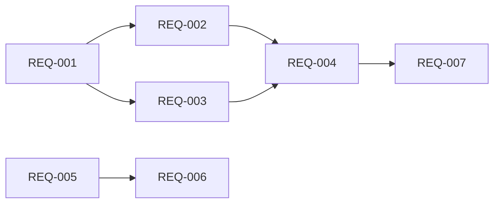

# Spec: Optimización de Escritura a Base de Datos

<!--
SPEC-V2-METADATA:
  version: "2.0"
  created: "2026-01-23"
  language: "es"
  quality:
    overall: 89
    ambiguity: 95
    testability: 85
    completeness: 88
  requirements_count: 8
  dependencies_count: 5
-->

## Objetivo de Negocio

Reducir el tiempo de indexación incremental de 5.8s a <2s para un solo archivo modificado,
y mejorar el tiempo de full reindex de 17s a <10s. Esto permite ejecutar el indexador
frecuentemente (pre-commit hooks, cambios de rama) sin impactar el flujo de trabajo.

## Análisis del Problema

### Cuello de Botella Principal: FTS5 Rebuild

El método `CreateIndexes()` (línea 672) se llama en cada batch commit y ejecuta:
```sql
DROP TABLE IF EXISTS symbols_fts;           -- Elimina índice FTS5
CREATE VIRTUAL TABLE symbols_fts USING fts5(...);  -- Recrea estructura
INSERT INTO symbols_fts SELECT... FROM symbols;    -- Repobla 621,906 filas
```

Este rebuild completo toma ~5 segundos sobre 621K símbolos.

### Cuello de Botella Secundario: PRAGMA synchronous

Actualmente `synchronous=2` (FULL), que fuerza fsync en cada commit.
`synchronous=1` (NORMAL) es suficiente para WAL mode y reduce latencia.

### Métricas Actuales

| Escenario | Tiempo Actual | Desglose |
|-----------|---------------|----------|
| Sin cambios | 10ms | Change detection only |
| 1 archivo | 5.8s | ~100ms parsing + 5.7s FTS rebuild |
| Full reindex | 17s | Parsing + multiple FTS rebuilds |

## Suposiciones Confirmadas

- [x] Se puede usar `synchronous=NORMAL` (pérdida recuperable con re-indexación)
- [x] Cambios de schema permitidos si mejoran rendimiento (requieren aprobación)
- [x] Optimizar tanto incremental como full reindex (en fases)

## Requisitos

### Fase 1: FTS5 Incremental (Mayor Impacto)

#### REQ-001: Crear FTS5 Solo Una Vez

| Campo | Valor |
|-------|-------|
| **Trigger** | Primera creación de base de datos o migración |
| **Sistema** | `TDatabaseBuilder.CreateTables` |
| **Acción** | Crear tabla `symbols_fts` con `CREATE TABLE IF NOT EXISTS` (no DROP+CREATE) |
| **Criterio** | FTS5 table persiste entre ejecuciones del indexer |

#### REQ-002: Actualización Incremental de FTS5

| Campo | Valor |
|-------|-------|
| **Trigger** | Inserción de nuevo símbolo en `InsertSymbol` |
| **Sistema** | `TDatabaseBuilder.InsertSymbol` |
| **Acción** | Insertar directamente en `symbols_fts` después del INSERT en `symbols` |
| **Criterio** | 0 llamadas a `SELECT... FROM symbols` para poblar FTS5 |

#### REQ-003: Eliminación Incremental de FTS5

| Campo | Valor |
|-------|-------|
| **Trigger** | Eliminación de archivo en `RemoveFileData` |
| **Sistema** | `TDatabaseBuilder.RemoveFileData` (ya existe, verificar) |
| **Acción** | DELETE de `symbols_fts` antes de DELETE de `symbols` |
| **Criterio** | Código existente en líneas 966-978 ya implementa esto (verificar funcionamiento) |

#### REQ-004: Separar CreateIndexes de FTS5

| Campo | Valor |
|-------|-------|
| **Trigger** | Llamada a `CreateIndexes` |
| **Sistema** | `TDatabaseBuilder.CreateIndexes` |
| **Acción** | Eliminar lógica de DROP/CREATE/POPULATE de FTS5. Solo crear índices regulares con `IF NOT EXISTS` |
| **Criterio** | `CreateIndexes` no contiene referencias a `symbols_fts` |

### Fase 2: PRAGMA Optimization

#### REQ-005: Usar PRAGMA synchronous=NORMAL

| Campo | Valor |
|-------|-------|
| **Trigger** | Apertura de conexión a base de datos |
| **Sistema** | `TDatabaseBuilder.CreateConnection` |
| **Acción** | Añadir `PRAGMA synchronous=NORMAL` después de `journal_mode=WAL` |
| **Criterio** | `PRAGMA synchronous` retorna 1 (NORMAL) en vez de 2 (FULL) |

#### REQ-006: Optimizar Cache Size

| Campo | Valor |
|-------|-------|
| **Trigger** | Apertura de conexión a base de datos |
| **Sistema** | `TDatabaseBuilder.CreateConnection` |
| **Acción** | Añadir `PRAGMA cache_size=-64000` (64MB de cache) |
| **Criterio** | Cache size configurado a 64MB (valor negativo = KB) |

### Fase 3: Full Reindex Optimization

#### REQ-007: Defer FTS5 para Full Reindex

| Campo | Valor |
|-------|-------|
| **Trigger** | Flag `--force` (full reindex) activo |
| **Sistema** | `TDatabaseBuilder.BuildDatabase` |
| **Acción** | 1) Eliminar FTS5 al inicio, 2) Insertar símbolos sin FTS, 3) Poblar FTS5 al final |
| **Criterio** | Solo 1 población de FTS5 por full reindex (no por batch) |

#### REQ-008: Batch Size Configurable para Full Reindex

| Campo | Valor |
|-------|-------|
| **Trigger** | Full reindex con muchos archivos (>1000) |
| **Sistema** | `TDatabaseBuilder.BuildDatabase` |
| **Acción** | Usar batch size de 500-1000 para full reindex (vs 50-100 actual) |
| **Criterio** | Tiempo de full reindex <10s para 600K símbolos |

## Dependencias



**Leyenda**:
- `A --> B` significa "B depende de A"

**Fases independientes**: Fase 1 y Fase 2 pueden ejecutarse en paralelo.
Fase 3 depende de Fase 1.

## Restricciones (NO Hacer)

- ❌ No eliminar soporte de embeddings (vec_embeddings debe seguir funcionando)
- ❌ No usar escrituras paralelas a SQLite (WAL solo permite 1 writer)
- ❌ No cambiar el schema de `symbols` sin flag de migración
- ❌ No usar `synchronous=OFF` (riesgo de corrupción inaceptable)

## Fuera de Alcance

- Optimización de lectura/búsqueda (delphi-lookup)
- Compresión de base de datos
- Sharding o particionado

## Cambios de Schema Propuestos

### Ninguno requerido

El schema actual es adecuado. Los cambios son:
1. **FTS5**: Ya usa `content='symbols'` (contentless), solo cambiar patrón de población
2. **PRAGMAs**: No afectan schema

## Métricas Objetivo

| Escenario | Actual | Objetivo | Mejora |
|-----------|--------|----------|--------|
| 1 archivo modificado | 5.8s | <1.5s | 4x |
| Full reindex (600K) | 17s | <10s | 1.7x |
| Sin cambios | 10ms | 10ms | - |

## Quality Summary

| Métrica | Score | Estado |
|---------|-------|--------|
| Ambigüedad | 95 | ✅ |
| Testeabilidad | 85 | ✅ |
| Completitud | 88 | ✅ |
| **Overall** | **89** | **✅ PASS** |
